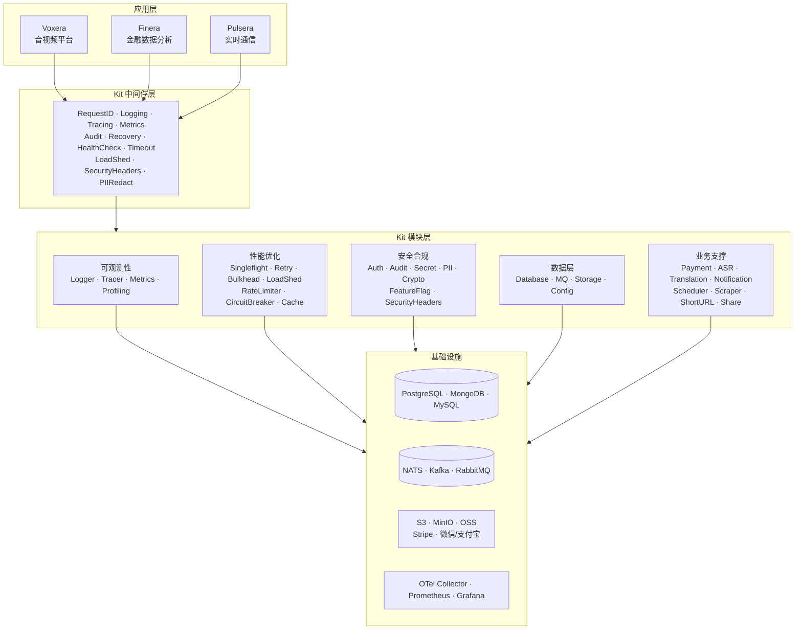

# voxera-kit

> 可插拔基础设施 SDK — 为 Voxera 系列产品提供统一的 Port + Adapter 架构基座。

<!-- badges -->


---

## 项目简介

**voxera-kit** 是一套基于六边形架构（Hexagonal Architecture / Ports & Adapters）的可插拔基础设施 SDK。它为后端提供 Go 模块、为前端提供 TypeScript 包，覆盖可观测性、性能优化、安全合规、数据层、业务支撑等领域。

核心理念：

- **Kit 只定义接口（Port）**，不绑定任何具体实现
- **适配器（Adapter）携带外部依赖**，按需引入
- **应用层（Voxera / Finera / Pulsera）专注业务逻辑**，通过 Kit 接口组装能力
- **渐进式采用** — 每个模块独立 `go.mod`，可单独 `go get`

---

## 架构设计



---

## 企业级特性对标

以下是 voxera-kit 覆盖的核心基础设施能力，及其对标的业界标杆方案：

| 能力域 | voxera-kit 实现 | 对标方案 | 状态 |
|--------|----------------|----------|------|
| **结构化日志** | `logger/` — Zap + Slog adapter, TraceID 自动注入, 批量 flush | Google Cloud Logging, ELK Stack, Uber Zap | ✅ 生产可用 |
| **分布式链路追踪** | `tracing/` — OpenTelemetry SDK, OTLP HTTP export, 采样率控制 | Google Dapper, Jaeger, Zipkin, AWS X-Ray | ✅ 生产可用 |
| **指标采集 (RED/USE)** | `metrics/` — Prometheus client, 自动 HTTP RED metrics | Google Borgmon, Prometheus, Datadog | ✅ 生产可用 |
| **性能剖析** | `profiling/` — pprof 按需开启 | Google-Wide Profiling, Pyroscope | ✅ 生产可用 |
| **熔断器** | `circuitbreaker/` — Closed/Open/HalfOpen 状态机 | Netflix Hystrix, Alibaba Sentinel, resilience4j | ✅ 生产可用 |
| **限流** | `ratelimiter/` — Token Bucket | Google Cloud Armor, Alibaba Sentinel, Kong | ✅ 生产可用 |
| **过载保护 (Load Shedding)** | `loadshed/` — AIMD 自适应算法 | Google Doorman, Envoy Adaptive Concurrency | ✅ 生产可用 |
| **隔离舱 (Bulkhead)** | `bulkhead/` — Semaphore 并发隔离 | Netflix Hystrix Bulkhead, resilience4j | ✅ 生产可用 |
| **请求去重** | `singleflight/` — x/sync/singleflight 封装 | Google Singleflight, Fastly Collapse | ✅ 生产可用 |
| **指数退避重试** | `retry/` — Exponential backoff + jitter + context | AWS SDK Retry, Google API Client | ✅ 生产可用 |
| **审计日志** | `audit/` — Writer/Reader 接口, 结构化 Entry | Google Cloud Audit Logs, AWS CloudTrail | ✅ 生产可用 |
| **PII 脱敏** | `pii/` — Regex 规则引擎 (email/phone/CC/SSN/IP) | Google DLP, AWS Macie | ✅ 生产可用 |
| **密钥管理** | `secret/` — Manager 接口, Env adapter | HashiCorp Vault, AWS Secrets Manager, GCP KMS | ✅ 接口就绪 |
| **特性开关 (Feature Flag)** | `featureflag/` — 确定性百分比分桶 (SHA-256) | LaunchDarkly, Google Experimentation, Unleash | ✅ 生产可用 |
| **mTLS** | `crypto/tls/` — Server + Client 双向 TLS | Istio mTLS, Google ALTS | ✅ 生产可用 |
| **安全响应头** | `security/headers/` — HSTS/CSP/X-Frame 预设 | Cloudflare, AWS WAF Headers | ✅ 生产可用 |
| **定时任务 (Cron)** | `scheduler/cron/` — robfig/cron/v3, 弹性调度 | Kubernetes CronJob, Quartz, Airflow | ✅ 生产可用 |
| **HTTP 中间件栈** | `middleware/` — 12 个可组合中间件 | go-chi middleware, Echo middleware, Gin | ✅ 生产可用 |
| **健康检查** | `middleware/healthcheck` — Liveness + Readiness + 依赖探测 | Kubernetes probes, Consul health checks | ✅ 生产可用 |
| **前端 Web Vitals** | `observability/` — LCP/CLS/INP/FID/Long Task 全采集 | Google Lighthouse, Sentry Performance | ✅ 生产可用 |
| **前端错误追踪** | `observability/` — 远程上报, 采样, beforeSend | Sentry, Bugsnag, Datadog RUM | ✅ 生产可用 |
| **前端用户审计** | `observability/audit` — 操作 batch 上报 | Amplitude, Mixpanel, FullStory | ✅ 生产可用 |
| **可观测性部署栈** | `deploy/` — OTel Collector + Prometheus + Grafana + Alertmanager | Google SRE Stack, Grafana Cloud | ✅ 配置就绪 |

### 与业界框架的定位差异

| 维度 | voxera-kit | Spring Boot | go-kratos | go-zero |
|------|-----------|-------------|-----------|---------|
| 架构模式 | Hexagonal (Port+Adapter) | Convention over Config | DDD + Clean Architecture | Monolithic toolkit |
| 语言 | Go + TypeScript 全栈 | Java only | Go only | Go only |
| 耦合度 | 模块独立 go.mod，按需引入 | 全家桶绑定 | 框架绑定 | 框架绑定 |
| 前端覆盖 | 16 个 TS 包（observability/i18n/theme/di/player...） | 无 | 无 | 无 |
| 可插拔适配器 | 每个模块 2-4 个适配器可选 | Starter 自动装配 | 内置唯一实现 | 内置唯一实现 |
| 部署配套 | OTel + Prometheus + Grafana + Alertmanager | Actuator + Micrometer | 无 | 无 |

---

## 后端模块索引

共 **38** 个 Go 模块（含子模块），均遵循 Port + Adapter 模式。

### 可观测性

| 模块 | 状态 | 端口（接口） | 适配器 | 说明 |
|------|------|-------------|--------|------|
| `observability/logger` | ✅ | `Logger` | Zap, Slog | 结构化日志，支持 TraceID 注入 |
| `observability/tracing` | ✅ | `Tracer` | OpenTelemetry | OTLP HTTP exporter, 批量 Span 处理 |
| `observability/metrics` | ✅ | `MetricsRecorder` | Prometheus | sync.Map 缓存 metric vectors |
| `observability/profiling` | ✅ | — | pprof | 可配置 pprof 端点注册 |

### 性能优化

| 模块 | 状态 | 端口（接口） | 适配器 | 说明 |
|------|------|-------------|--------|------|
| `singleflight` | ✅ | `Deduplicator` | sync | 请求去重（x/sync/singleflight） |
| `retry` | ✅ | `Retrier`, `Policy` | exponential | 指数退避 + jitter |
| `bulkhead` | ✅ | `Bulkhead` | semaphore | 并发隔离（buffered channel） |
| `loadshed` | ✅ | `Shedder`, `Token` | adaptive | AIMD 自适应过载保护 |
| `ratelimiter` | ✅ | `Limiter` | memory | 速率限制 |
| `circuitbreaker` | ✅ | `CircuitBreaker` | memory | 熔断器 |
| `cache` | ✅ | `Cache` | Redis, Memcached, Local (ristretto) | 多级缓存 |
| `compression` | ✅ | `Compressor` | gzip | 数据压缩 |
| `concurrency` | ✅ | `Pool` | channel | 并发任务池 |

### 安全合规

| 模块 | 状态 | 端口（接口） | 适配器 | 说明 |
|------|------|-------------|--------|------|
| `auth` | ✅ | `Authenticator`, `Authorizer` | JWT, OAuth2, OIDC | 认证授权 |
| `audit` | ✅ | `Writer`, `Reader` | memory, noop | 审计日志 |
| `secret` | ✅ | `Manager` | env | 密钥管理（环境变量前缀） |
| `pii` | ✅ | `Redactor`, `Rule` | regex | PII 脱敏（email/phone/CC/SSN/IP） |
| `featureflag` | ✅ | `Store`, `Flag` | memory | 特性开关（SHA-256 确定性百分比） |
| `security` | ✅ | `Config` | headers, memory | HSTS / CSP / X-Frame 安全头 |
| `crypto` | ✅ | `Encryptor` | AES, bcrypt, TLS | 加密 / 哈希 / mTLS |

### 可靠性

| 模块 | 状态 | 端口（接口） | 适配器 | 说明 |
|------|------|-------------|--------|------|
| `messaging` | ✅ | `Messenger` | memory | 进程内消息传递 |
| `registry` | ✅ | `Registry` | memory | 服务注册发现 |

### 数据层

| 模块 | 状态 | 端口（接口） | 适配器 | 说明 |
|------|------|-------------|--------|------|
| `database` | ✅ | `Repository[T]`, `Transaction`, `Database` | PostgreSQL, MongoDB, MySQL | 通用数据库抽象 |
| `mq` | ✅ | `Publisher`, `Subscriber` | NATS, Kafka, RabbitMQ | 消息队列 |
| `storage` | ✅ | `ObjectStore` | S3, MinIO, 阿里云 OSS | 对象存储 |
| `config` | ✅ | 配置加载接口 | Viper-based | 配置管理 |
| `errors` | ✅ | `AppError`, `ErrorCode` | — | 统一错误类型 |
| `dataprovider` | ✅ | `DataProvider`, `FinancialProvider` | stub | 通用 / 金融数据源 |
| `dataparser` | ✅ | `DocumentParser` | CSV, stub | 文档解析（PDF/CSV/XLSX/HTML） |

### 业务支撑

| 模块 | 状态 | 端口（接口） | 适配器 | 说明 |
|------|------|-------------|--------|------|
| `payment` | ✅ | `PaymentGateway` | Stripe, 微信支付, 支付宝, PayPal | 支付网关 |
| `asr` | ✅ | `Recognizer` | Whisper, Azure, 阿里云, 自部署 | 语音识别 |
| `translation` | ✅ | `Translator` | OpenAI, DeepL, Google | 文本翻译 |
| `notification` | ✅ | `Notifier` | Email, 飞书, 企业微信, stub | 通知推送 |
| `scheduler` | ✅ | `Scheduler` | cron, memory | 定时任务 |
| `scraper` | ✅ | `Scraper` | HTTP, memory | 网页抓取 |
| `shorturl` | ✅ | `ShortURL` | memory | 短链接 |
| `share` | ✅ | `ShareService` | memory | 分享服务 |

### 基础设施

| 模块 | 状态 | 端口（接口） | 适配器 | 说明 |
|------|------|-------------|--------|------|
| `framework` | ✅ | `Server`, `HTTPServer`, `RPCServer` | go-kratos, CloudWeGo (Hertz/Kitex) | 框架适配 |
| `middleware` | ✅ | — | 12 个 net/http 中间件 | Chain / RequestID / Logging / Tracing 等 |

---

## 前端包索引

共 **16** 个 TypeScript 包，Turborepo + pnpm workspace 管理。

| 包名 | 说明 | 状态 |
|------|------|------|
| `@voxera-kit/di` | IoC/DI 容器，Singleton/Transient 生命周期，层级子容器 | ✅ |
| `@voxera-kit/plugin` | 插件系统，生命周期管理，依赖拓扑排序 | ✅ |
| `@voxera-kit/player` | 播放器抽象层（xgplayer / video.js / hls.js） | ✅ |
| `@voxera-kit/theme` | CSS Variables 主题引擎（light / dark / high-contrast） | ✅ |
| `@voxera-kit/i18n` | 框架无关国际化引擎，嵌套键、插值、locale 切换 | ✅ |
| `@voxera-kit/federation` | Module Federation 工具，host 加载器 + remote 定义器 | ✅ |
| `@voxera-kit/api-client` | 类型安全 HTTP/WebSocket 客户端，拦截器链、自动重试 | ✅ |
| `@voxera-kit/observability` | 前端可观测性：Web Vitals / OTel 追踪 / 错误追踪 / 审计 | ✅ |
| `@voxera-kit/config` | 共享 TSConfig / ESLint / Prettier 配置 | ✅ |
| `@voxera-kit/spreadsheet` | 电子表格引擎抽象（Univer / AG Grid） | ✅ |
| `@voxera-kit/chart` | 图表引擎抽象（ECharts / visx），7 种图表类型 | ✅ |
| `@voxera-kit/clipboard` | 剪贴板表格解析，自动识别 Excel / Google Sheets / 飞书等 | ✅ |
| `@voxera-kit/feed` | 信息流 / Feed 组件 | ✅ |
| `@voxera-kit/seo` | SEO 工具集 | ✅ |
| `@voxera-kit/server` | 服务端渲染工具 | ✅ |
| `@voxera-kit/cache` | 前端缓存策略 | ✅ |

---

## 部署配套

`deploy/` 目录提供一键本地可观测性栈：

| 文件 | 说明 |
|------|------|
| `docker-compose.observability.yml` | 一键启动完整可观测性环境 |
| `otel-collector.yaml` | OTLP 接收 → Jaeger + Prometheus 导出 |
| `prometheus.yml` | 多服务抓取配置 |
| `alertmanager.yml` | 告警路由 |
| `alert-rules.yml` | 预置告警规则 |
| `grafana/` | Dashboard + Provisioning 配置 |

```bash
cd deploy && docker compose -f docker-compose.observability.yml up -d
```

---

## 快速开始

在你的 Go 项目中引入所需模块：

```go
// 1. 引入接口（零外部依赖）
import "github.com/EthanShen10086/voxera-kit/cache"

// 2. 引入适配器（携带 Redis 依赖）
import "github.com/EthanShen10086/voxera-kit/cache/redis"

// 3. 面向接口编程
func NewService(c cache.Cache) *Service {
    return &Service{cache: c}
}

// 4. 在 main 中组装
func main() {
    c := redis.New("localhost:6379")
    svc := NewService(c)
    // ...
}
```

`go.mod` 中按需添加：

```
require github.com/EthanShen10086/voxera-kit/cache v0.6.0
```

> 本地开发时可使用 `replace` 指令指向本地路径。

---

## 本地开发

### 前置条件

| 工具 | 版本 |
|------|------|
| Go | 1.22+ |
| Node.js | 20+ |
| pnpm | 9+ |

### 构建 & 检查

```bash
git clone https://github.com/EthanShen10086/voxera-kit.git
cd voxera-kit

# 后端
cd backend && go work sync && go build ./...
cd .. && make lint    # golangci-lint
make test             # 全量测试

# 前端
cd frontend && pnpm install
pnpm run lint
pnpm run typecheck
```

---

## 设计原则

1. **Port + Adapter 分离** — 接口定义在模块根目录 `port.go`，适配器在子目录
2. **接口零外部依赖** — `port.go` 仅依赖标准库，应用层可安全引入
3. **适配器携带依赖** — Redis、Kafka 等依赖仅在对应适配器的 `go.mod` 中声明
4. **渐进式采用** — 每个模块独立 `go.mod`，按需 `go get`，不强制全量引入
5. **严格 Lint** — golangci-lint 15 个 linter + 0-warning 策略；前端 ESLint flat config + Prettier
6. **Conventional Commits** — commitlint + husky 强制提交规范

---

## 项目结构

```
voxera-kit/
├── backend/
│   ├── go.work                    # Go workspace
│   ├── observability/             # 可观测性（logger / tracing / metrics / profiling）
│   ├── cache/                     # 缓存（redis / memcached / local）
│   ├── database/                  # 数据库（postgres / mongodb / mysql）
│   ├── mq/                        # 消息队列（nats / kafka / rabbitmq）
│   ├── storage/                   # 对象存储（s3 / minio / oss）
│   ├── auth/                      # 认证授权（jwt / oauth2 / oidc）
│   ├── payment/                   # 支付（stripe / wechat / alipay / paypal）
│   ├── middleware/                 # 12 个 HTTP 中间件
│   ├── framework/                 # 框架适配（kratos / cloudwego）
│   ├── ...                        # 其余 28 个模块
│   └── .golangci.yml
├── frontend/
│   ├── packages/
│   │   ├── di/                    # IoC 容器
│   │   ├── player/                # 播放器抽象
│   │   ├── spreadsheet/           # 电子表格引擎
│   │   ├── chart/                 # 图表引擎
│   │   ├── observability/         # 前端可观测性
│   │   └── ...                    # 其余 11 个包
│   ├── turbo.json
│   └── pnpm-workspace.yaml
├── deploy/                        # 可观测性部署配置
├── .github/workflows/             # CI/CD（lint / test / release）
├── Makefile                       # 12 个 Make 目标
├── CHANGELOG.md
├── CONTRIBUTING.md
└── LICENSE                        # MIT
```

---

## 贡献指南

请参阅 [CONTRIBUTING.md](./CONTRIBUTING.md)，包含环境要求、代码风格、Commit 规范与 PR 流程。

---

## 许可证

[MIT](./LICENSE) © voxera-kit contributors
