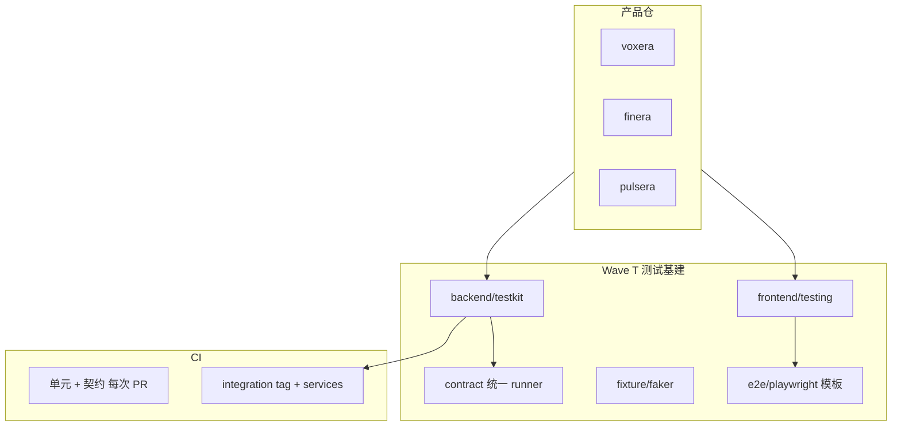

# voxera-kit 测试基建计划（Wave T）

> 定位：在数据平面（storage/cache/mq/database/task/secret）落地之后，补齐**可复用测试能力**，供 voxera / finera / pulsera 等产品统一使用。  
> 与运行时 kit 分离：本 wave **不替代**各产品业务测试，只提供 harness、fake、契约与 CI 模板。

## 现状盘点

| 能力 | 已有 | 缺口 |
|------|------|------|
| 后端契约测试 | `storage/contract`、`cache/contract`、`mq/contract` + 各 `memory` fake | 无统一 `testkit` 入口；database/task/secret 契约不全 |
| 后端集成测试 | 无 CI job | 无 testcontainers；MinIO/Redis/NATS/Postgres 未进 pipeline |
| 前端单测 | 各包 Vitest（api-client、theme、di…） | 无共享 setup、无 MSW 包 |
| UI / E2E | 无 | 无 Playwright 配置、无 page object 库 |
| 造数 / Mock | `backend/fixture`、`@voxera-kit/fixture`、**`@voxera-kit/faker`**（可插拔） | 产品接 testkit（TODO） |
| 覆盖率门禁 | **8% enforce**（阶梯 15→30→50→80，见 `COVERAGE_ROADMAP.md`） | 下一档 15% |

## 目标架构



## Wave T 分阶段

### T0 — 文档与约定（1–2 天）

- 状态图例写入根 README：`✅ 生产` / `🟡 契约+adapter` / `🔶 部分` / `❌ 缺失`
- 各数据平面模块 README：如何跑 contract、integration tag 说明
- `docs/testing.md`：产品接入 testkit 的标准姿势

### T1 — 后端 testkit（3–5 天）

新建 `backend/testkit/`：

| 包 | 职责 |
|----|------|
| `testkit/containers` | testcontainers-go 封装：`StartRedis`、`StartMinIO`、`StartNATS`、`StartPostgres` |
| `testkit/contract` | 重导出各模块 `Run*Contract`，单入口 `testkit.RunDataPlaneSmoke(t)` |
| `testkit/assert` | 共享错误断言（`errors.Is(ErrNotFound)` 等） |

**验收**：`go test -tags=integration ./testkit/...` 在本地 Docker 下绿；CI 新增 `integration` job（services: redis, minio, nats, postgres）。

### T2 — 契约补全（2–3 天）

| 模块 | 动作 |
|------|------|
| `database` | `RunDatabaseContract`（Ping/Transaction mock 已有 → 加 postgres 集成） |
| `task` | `RunTaskContract`（Enqueue/Schedule/Cancel） |
| `secret` | `RunSecretContract`（env roundtrip；vault 可选 integration） |
| `storage` | minio/s3 integration contract（复用 T1 MinIO） |

### T3 — 造数与 fixture（2–4 天）

| 包 | 内容 |
|----|------|
| `backend/fixture` | 通用 ID、时间、HTTP 请求 builder |
| `backend/fixture/media` | 媒体对象 key、小文件 bytes |
| `frontend/packages/fixture` | 用户/session/API 响应 JSON 工厂 |
| 可选 `@voxera-kit/faker` | 基于 faker.js 或自研轻量随机（避免重依赖可先 fixture） |

与现有 `dataprovider/stub` 关系：**领域数据**留 dataprovider；**测试通用造数**走 fixture。

### T4 — 前端测试基建（3–5 天）

新建 `frontend/packages/testing/`：

| 导出 | 说明 |
|------|------|
| `setupVitest` | 统一 vitest config 片段、coverage 阈值 |
| `mswHandlers` | 通用 REST handler（auth、分页、错误码） |
| `renderWithProviders` | 可选：theme/i18n/di 包裹（按产品选用） |

**不包含**：具体页面 E2E（留在产品仓）。

### T5 — E2E 模板（可选，2–3 天）

- `templates/e2e-playwright/`：playwright.config.ts、登录 flow 示例、CI workflow 片段
- 产品复制模板，不强制进 kit 主模块

### T6 — CI 与质量门禁（1–2 天）

- PR：unit + contract（无 Docker）
- main/nightly：`integration` + 可选 E2E smoke
- codecov 或 coverprofile 合并（backend `go test -cover` 分模块）

## 与数据平面 Plan 的关系

| 数据平面 Wave | 测试基建依赖 |
|---------------|-------------|
| W1 storage | T1 MinIO container + T2 storage integration contract |
| W2 cache/mq | T1 Redis/NATS + mq integration |
| W3 database | T1 Postgres |
| W4 task | T2 task contract |
| W5 secret | T2 secret contract + vault dev optional |
| W7 产品接入 | 产品引用 `memory` fake 单测；集成测用 testkit |

## 非目标

- 替代 MsgGuard 自有测试栈
- kit 内建完整 Playwright 用例库（只提供模板）
- 100% 云厂商 emulator（用 testcontainers + S3 兼容 MinIO 即可）

## 建议排期

```
T0 → T1 → T2（与 T1 部分并行）→ T3 → T4 → T5（可选）→ T6
```

**优先级**：T0 + T1 + T2 先于 T4/T5；产品可在 T1 完成后写真实集成测。

## 成功标准

1. 任一产品可通过 `testkit/containers` 起依赖并跑通 storage+cache+mq smoke
2. CI 分 `unit`（必过）与 `integration`（main 必过）
3. 前端新产品 `pnpm test` 可复用 `@voxera-kit/testing` setup
4. 文档中测试能力与运行时能力矩阵一样诚实
