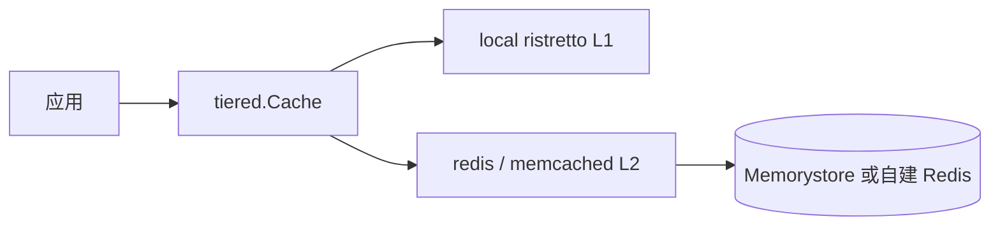

# 缓存性能基准与 Memorystore 对标

> 说明如何用 voxera-kit 的 `cache/tiered` 组合 **进程内 L1 + 远程 L2**，以及如何在本地复现基准、对照 [Google Cloud Memorystore](https://cloud.google.com/memorystore) 的 Redis/Memcached 部署。

**相关代码：** `backend/cache/tiered` · [cache README](../backend/cache/README.md)

---

## 1. 对标关系

| Google Cloud | voxera-kit | 典型延迟（同可用区） | 适用场景 |
|--------------|------------|----------------------|----------|
| **Memorystore for Redis** | `cache/redis` + `tiered` L2 | ~0.3–1 ms RTT（官方同区 P99 亚毫秒级；跨区更高） | 结构化数据、TTL、分布式锁、会话 |
| **Memorystore for Memcached** | `cache/memcached` | 类似 Redis，协议更简单 | 纯 KV、无持久化需求 |
| **（无托管等价物）进程内** | `cache/local`（ristretto） | **亚微秒～数十 ns/op**（见下文基准） | 热 key、读多写少、可接受最终一致 |
| **组合方案** | `cache/tiered`（local + redis） | L1 命中 ≈ local；L1 未命中 ≈ Redis + 回填 | **推荐默认**：降 Redis QPS、抗热点 |

Memorystore 是**托管 Redis/Memcached**，不是 GCP 自带的「多级」产品。Kit 的 `tiered` 在应用侧实现 **L1 ristretto + L2 Redis**，在语义上对标「自建多级缓存 + Memorystore 作 L2」的常见架构。

---

## 2. 架构与读写路径



| 操作 | 行为 | 延迟特征 |
|------|------|----------|
| **Get（L1 命中）** | 仅访问 L1 | ≈ `BenchmarkLocal_Get` |
| **Get（L1 未命中，L2 命中）** | 读 L2 + 回填 L1 | ≈ Redis RTT + ristretto Set |
| **Set / SetWithTTL** | 写穿所有层 | ≈ L1 + L2 写延迟之和 |
| **Delete** | 各层删除 | 同上 |

**设计取舍：**

- 写穿保证各层一致，**写路径比单层 Redis 慢**（见 `BenchmarkTiered_Set`）。
- 读路径在 L1 预热后接近纯本地，适合 **读远大于写** 的配置/会话/权限等热数据。
- L2 使用 Memorystore 时，务必设置 **TTL**，避免 L1/L2 长期不一致（L1 条目由 ristretto 按 cost/TTL 驱逐）。

---

## 3. 推荐生产配置

```go
l1, err := local.New(cache.Config{})
if err != nil {
    return err
}
l2 := redis.New(cache.Config{
    Address: os.Getenv("REDIS_ADDR"), // Memorystore 内网地址:6379
    PoolSize: 32,
    ReadTimeout:  200 * time.Millisecond,
    WriteTimeout: 200 * time.Millisecond,
})
cache, err := tiered.New(l1, l2)
```

| 项 | 建议 |
|----|------|
| **Key 前缀** | `{service}:{tenant}:{entity}:{id}`，避免跨服务冲突 |
| **TTL** | 一律 `SetWithTTL`；会话 15–60m，配置 5–30m |
| **Value 大小** | 单 key &lt; 512 KiB；更大对象用 `storage` |
| **L1 容量** | ristretto 默认 MaxCost 1 GiB；按进程内存调整 `local` 构造参数（未来可暴露 Config） |
| **失效** | 更新数据时 `Delete` 或短 TTL；不要依赖 `Flush` 生产 |
| **监控** | Redis：命中率、`used_memory`、evicted；应用：L1 命中可用自定义 metric 包装 `Get` |

---

## 4. 本地基准（可复现）

### 4.1 运行命令

```bash
cd backend/cache/tiered
go test -bench=. -benchmem -count=5
```

- **L1/L2 单测环境：** `memory` / `local` / `miniredis`（TCP loopback），**不含**真实 Memorystore 网络。
- **生产对比：** 在 GCE/GKE 同 VPC 内对 Memorystore 实例再跑一轮（见 §5）。

### 4.2 参考结果（开发机样本）

环境：**darwin / arm64 / Apple M4 Pro**，value **256 B**，`miniredis` 作 Redis。  
**勿将绝对值当作 SLA**；关注 **数量级与相对比**。

| Benchmark | ns/op（约） | B/op | allocs/op | 解读 |
|-----------|------------|------|-----------|------|
| `Memory_Get` | 54 | 256 | 1 | 纯 map 基线 |
| `Local_Get` | 35 | 20 | 1 | ristretto L1，最快 |
| `Redis_Get` | 47k–67k | 664 | 20 | loopback TCP ≈ 0.05–0.07 ms/op |
| `Tiered_L1Hit` | 38–41 | 22 | 1 | **≈ 纯 local**，tiered 开销可忽略 |
| `Tiered_L2Hit` | 0.30–0.31 ms | ~34k | 544 | L1 每次 flush 后冷启动 + 回填 |
| `Tiered_Set` | 52k–54k | ~1.3k | 30 | 写穿 L1+L2 |

**结论（数量级）：**

1. **L1 命中**比 Redis 快 **约 3 个数量级**（本机 ~40 ns vs ~50 µs）。
2. **tiered 写**比单层 Redis 写慢约 **同量级**（多写一层 ristretto）。
3. 真实 Memorystore 的 `Redis_Get` 通常为 **数百 µs～数 ms**（取决于区域、负载、value 大小），比 miniredis loopback **慢 1–2 个数量级**；**L1 收益在生产环境往往更大**。

---

## 5. 在 GCP 上对 Memorystore 压测（可选）

在 **与 Memorystore 同 VPC** 的 VM 或 GKE Pod 上：

```bash
# 需已部署 Redis 实例并放通 VPC
export REDIS_ADDR="10.x.x.x:6379"
cd backend/cache/tiered

# 可新增 -benchtime=3s 延长采样
go test -bench=BenchmarkRedis_Get -benchmem -count=5
```

对比同一机器上的：

```bash
go test -bench='Benchmark(Local|Tiered_L1Hit)_Get' -benchmem -count=5
```

记录：

- 同区 Memorystore P50/P99 GET 延迟
- tiered L1 命中延迟（应接近 `Local_Get`）
- 估算：**热 key 比例 × (Redis_latency − Local_latency)** 为节省的 Redis QPS 时间

官方参考：[Memorystore Redis 性能最佳实践](https://cloud.google.com/memorystore/docs/redis/general-best-practices)（连接池、同区部署、避免大 key / `KEYS`）。

---

## 6. 何时用 / 不用 tiered

| 用 tiered | 不用 tiered（仅 Redis/Memorystore） |
|-----------|-------------------------------------|
| 读多写少、key 可重复命中 | 写密集、强一致读写 |
| 可接受 L1 短时不一致（有 TTL） | 多实例间需立即全局一致 |
| 希望降低 Memorystore QPS 与成本 | 值极大或流式对象 |
| 单进程内热点明显 | 仅作分布式锁 / pub-sub（非 Cache 接口） |

---

## 7. 与路线图 / 测试的关系

| 文档 | 内容 |
|------|------|
| [DATA_PLANE_ROADMAP.md](./DATA_PLANE_ROADMAP.md) | 数据平面 #9 多级缓存 |
| [TESTING_INFRA_PLAN.md](./TESTING_INFRA_PLAN.md) | testkit `StartRedis` 集成测 |
| `backend/cache/tiered/bench_test.go` | 可复现的 `go test -bench` |

契约测试（正确性）与基准（性能）分离：PR 跑 `go test ./...`；发布前或调优时跑 `-bench`。

---

## 8. 维护

- 修改 `tiered` 读写逻辑后，重跑 §4.1 并更新 §4.2 表格（注明日期与 CPU）。
- Memorystore 版本或网络架构变更时，更新 §5 环境说明即可，无需改代码。

**Last benchmark sample:** 2026-06-18 · Apple M4 Pro · Go 1.25
